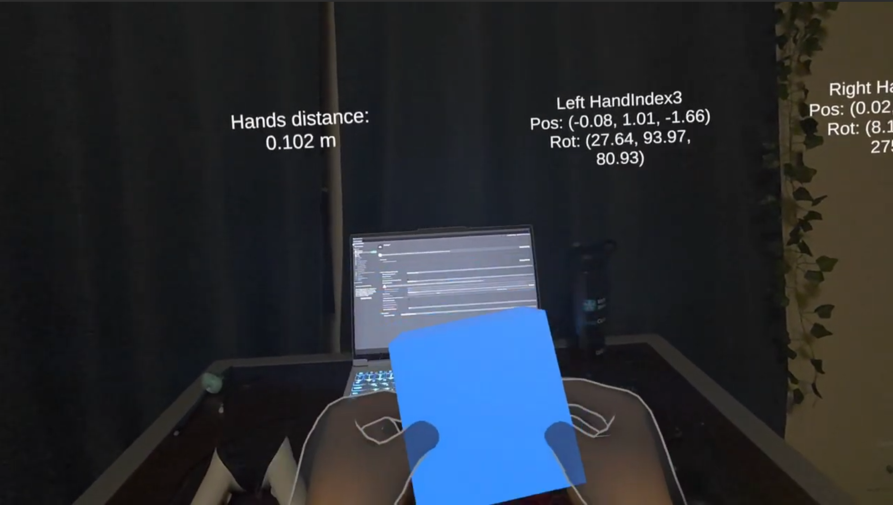
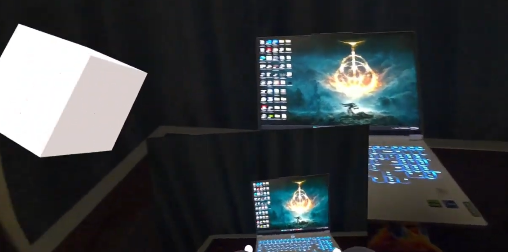
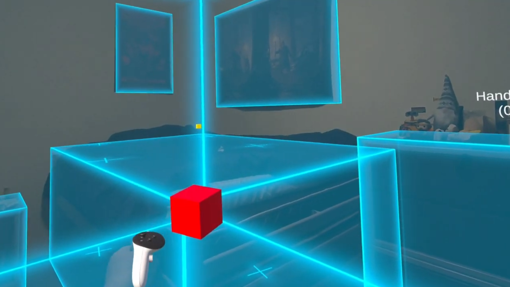

# Mixed Reality AI Assistant — Meta Quest 3

A series of MR experiments built for CSCI 5629, progressively adding AI capabilities to a physical cube in your room. By the end it can hear you, see what you see, understand your space, and move to furniture on command.

Built with Unity 6000.3.6f1, Meta XR SDK 85.0.0, and Azure OpenAI.

---

## What it does

**Hand Tracking (A2)**

Tracks both hands in real time and displays live joint positions. Detects a thumbs-up gesture by combining finger shape recognition and wrist orientation using Meta's Interaction SDK. Includes two-hand grab scaling as a bonus.

**Talking Cube (A3)**

*(demo video coming soon)*

Hold the left trigger to talk to a cube. It listens, thinks, and talks back. Full speech-to-speech pipeline: Whisper STT → GPT → TTS. The cube changes color to show what it's doing and remembers the full conversation across turns.

**Camera Vision (A4)**

The cube can now see what you see. Captures a live frame from the Quest's passthrough camera via async GPU readback and sends it alongside your voice message to GPT. Ask "what do you see?" and it describes your room. Only the current frame is sent per turn to keep costs low.

**Scene Navigation (A5)**

The cube becomes spatially aware. It reads your room through MRUK, knows what furniture is there, and moves to it when you ask. Say "go to the table" and it glides there. Say "build something on the couch" and it moves over and spawns a voxel object on arrival. Powered by OpenAI function calling — the model picks targets from a live JSON list of scene candidates and invokes the right tool.

---

## Stack

- Unity 6000.3.6f1 + OpenXR
- Meta XR SDK 85.0.0 (MRUK, Interaction SDK, Passthrough Camera)
- Azure OpenAI (GPT, Whisper, TTS)
- com.openai.unity via OpenUPM

---

## Setup

1. Open Unity Hub → Add project from disk
2. Use Unity 6000.3.6f1 (other versions untested)
3. Let Library regenerate on first open
4. Run on Meta Quest 3 via Link or direct build
5. Scan your room before using voice navigation

> **Note:** The AI features (A3, A4, A5) require Azure OpenAI credentials that were
> provided through the course and are no longer active. The hand tracking and gesture
> features (A2) will work without any API keys.
